# 1.简介

百川 · 被动信息收集及数据融合工具 （项目地址 https://github.com/fankun99/baicuan ）：

- 支持对多个网络空间搜索引擎进行本地查询、数据融合、IP聚合、搜索引擎化展示。

- 帮助信息安全从业者快速搜集目标资产，提供IP聚合展示和检索，快速筛出关联资产及重要资产。

- 使用pyqt5开发，目前的v1.0版本提供了最实用的shodan、fofa网络空间搜索引擎的自动化检索及融合，预留了zoomeye和censys界面接口，有需要的小伙伴可以fork下来自己添加更多引擎。

  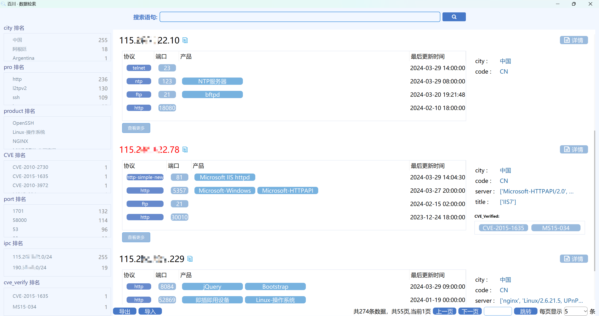

# 2.使用说明

## 开始运行

请使用python3.6以上版本运行。或下载release版本exe直接运行。运行后，首先默认进入数据检索页面。

```
python main.py
```

## fofa查询

在fofa界面搜索：

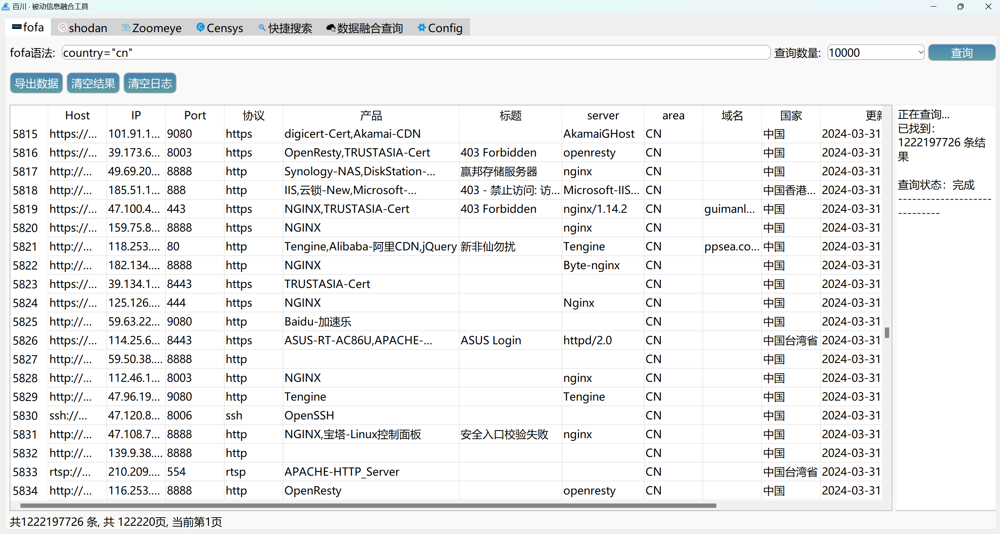

在搜索时每次点击“查询”按钮后，都会把当前检索条件搜出的资产续插到表尾和内存中，这样可以多次搜索不同的条件来累积想导出的资产，最后再点击“导出数据”按钮，则可以一次性刚才检索出的所有结果（导出为csv）。 请注意，导出会把当前表中多次查询到的累积所有结果都导出，如果你不想要之前的历史结果，可以点击清空后重新查询，再导出。

## shodan查询

支持导出IP、端口、产品、标题、web组件、漏洞、域名、组织、主机名、isp等。

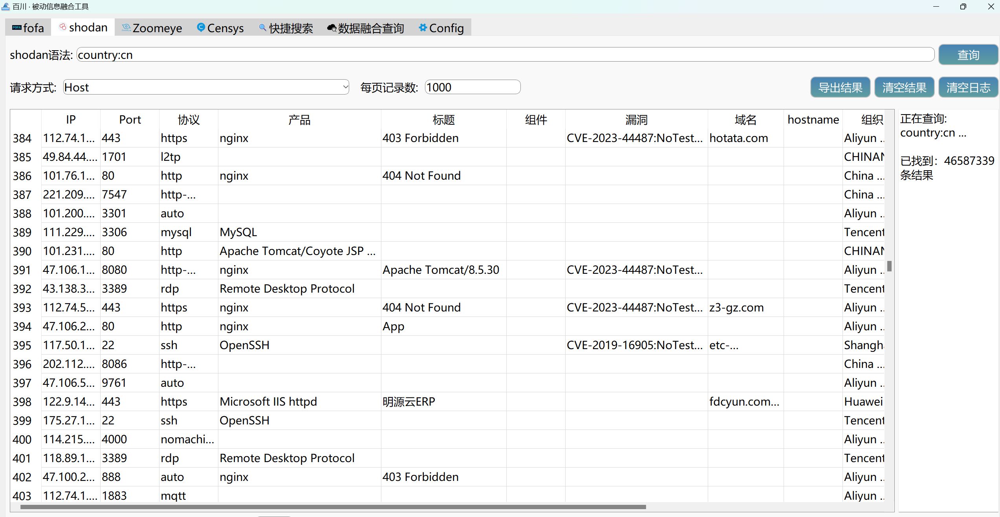

## *快捷搜索

支持对fofa、shodan的常用检索字段进行快捷搜索，不用记忆字段名，你只需要输入对应的检索值，目前支持自动检索：

- IP/IP段
- 域名
- 证书所有字段（写着Subject其实是从cert所有字段）
- title
- 端口
- 国家
- header
- body
- 组织org
- 自定义（可以输入任何fofa/shodan网页上支持的多条件组合检索语句，需要在你的语句前加上fofa: 或者 shodan: 即可）

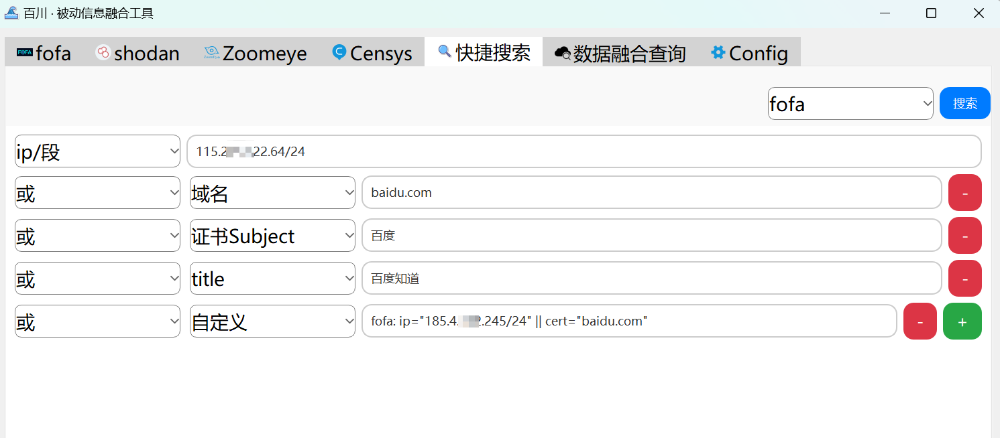

点击搜索后，会调用api去自动查询，注意多个条件之间的逻辑关系都是”或“，查询成功会自动跳转到fofa/shodan的展示页。


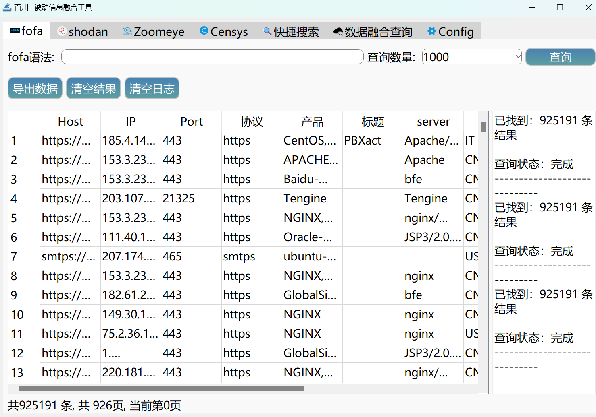

## *数据融合查询

该界面基本和快捷查询一致，区别在于没有选择搜索引擎的下拉菜单了，因为会根据检索的项从所有支持的网络空间搜索引擎去查询。注意调用的api所设置的最大查询数会按照各自搜索引擎选项卡页中设置的，比如fofa默认10000条，shodan默认查1000条，可以自己修改。

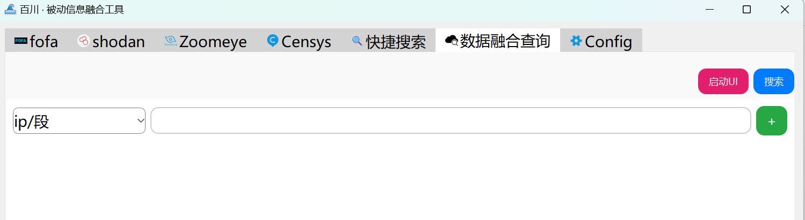


上图中，”**启动UI**“按钮可以直接打开百川数据融合展示页面，会根据当前fofa和shodan的选项卡页面中已查询到的资产记录做融合，如果没有则显示空白页，你可以使用下方的”导入“按钮来导入之前在该页面导出的json文件，可以再次浏览、检索。

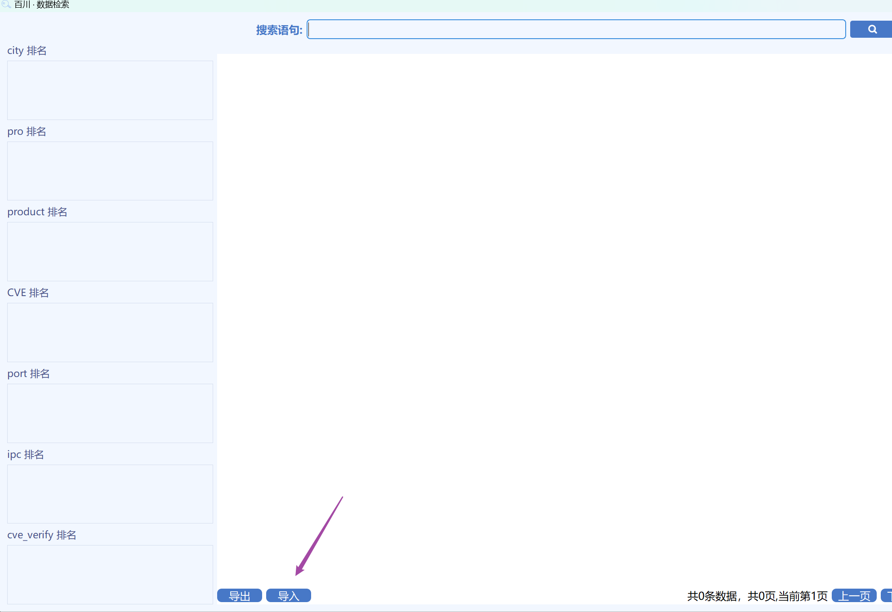

在数据融合查询页面点击搜索后，会调用api去查询，对查询结果进行IP聚合及分析，merge合并多家网络空间测绘引擎中每个端口的最新探测数据、提取漏洞数据，并自动打开百川数据展示界面，每条记录都是非重的独立IP，展示该IP上的聚合信息（端口、协议、http标题聚合、产品聚合、城市、cve漏洞聚合），方便分析和排查关联资产与核心资产：


## 数据融合检索页面

### 资产信息

标红的IP表示根据shodan查询提供的CVE信息，这个IP有被验证成功的漏洞。

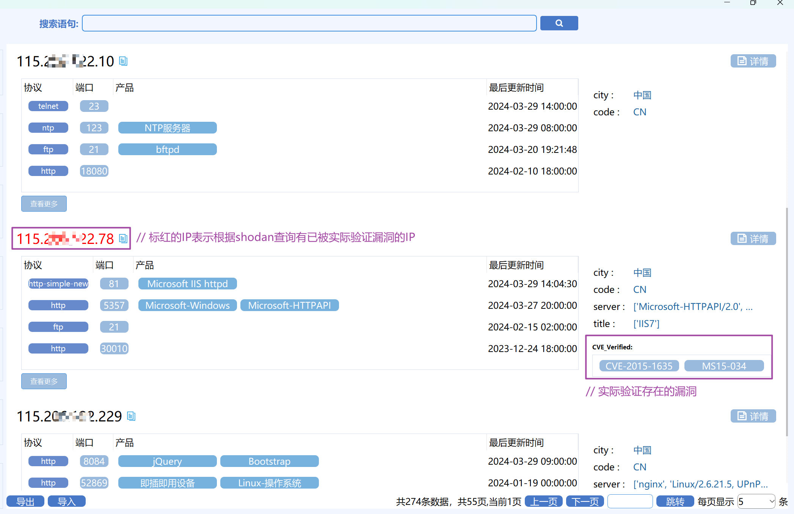

### 资产详情

点击右侧的”详情“按钮可以查看该资产详情，如下。其中，绿色的CVE表示被验证过实际存在漏洞，蓝色的CVE表示根据版本识别可能存在的漏洞：

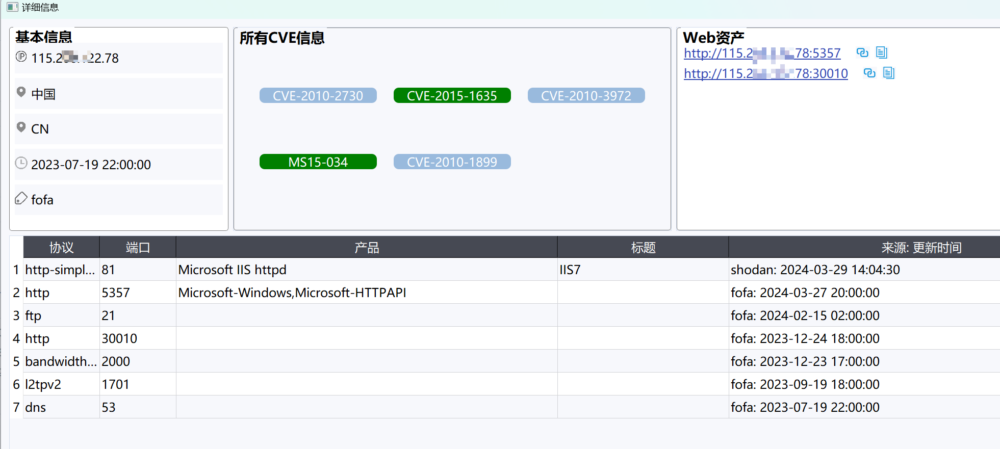

点击其中的cve按钮，可以查看从shodan得到的cve详情：

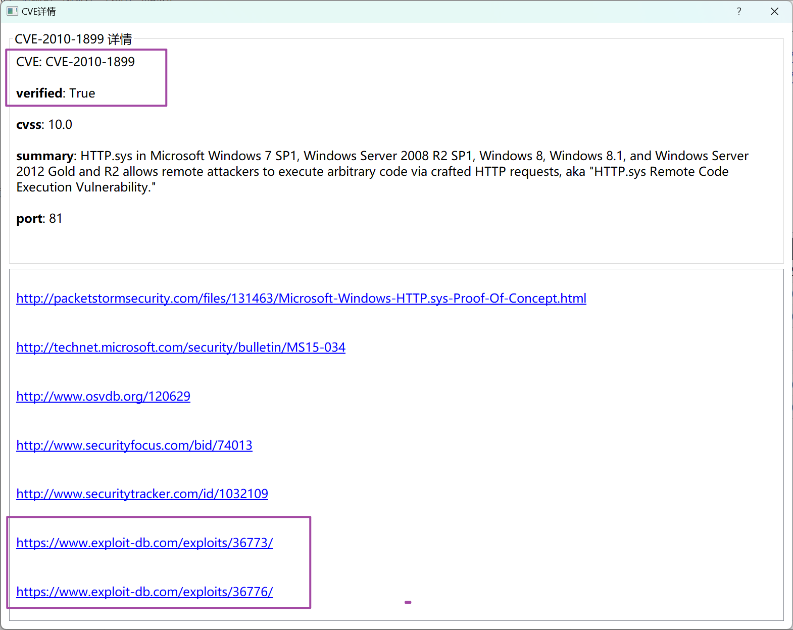

### 资产检索

所有可以点击的项都能自动跳转到检索（如ip段、端口、产品、协议等），支持对左侧所有统计的字段进行搜索，格式为 关键词:值 （冒号后不要自己加空格或空白符。值的中间可以有空格，因为是完全匹配搜索），支持使用逻辑表达式 && 、||来 表示与、或：

- ip:8.8.8.8

- port:80

- city:阿根廷

- pro:http

- product:NGINX

- vulns:CVE-2023-44487

- ipc:8.8.8.0/24   （注意搜c段时，ip最后一位必须是0）

- cve_verify:CVE-2023-44487

- ipc:8.8.8.0/24 && port:1080

  

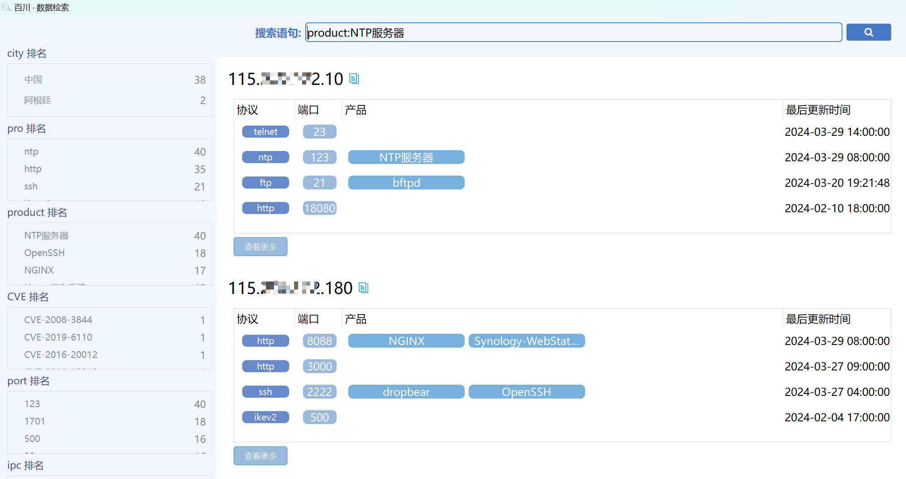

## API配置

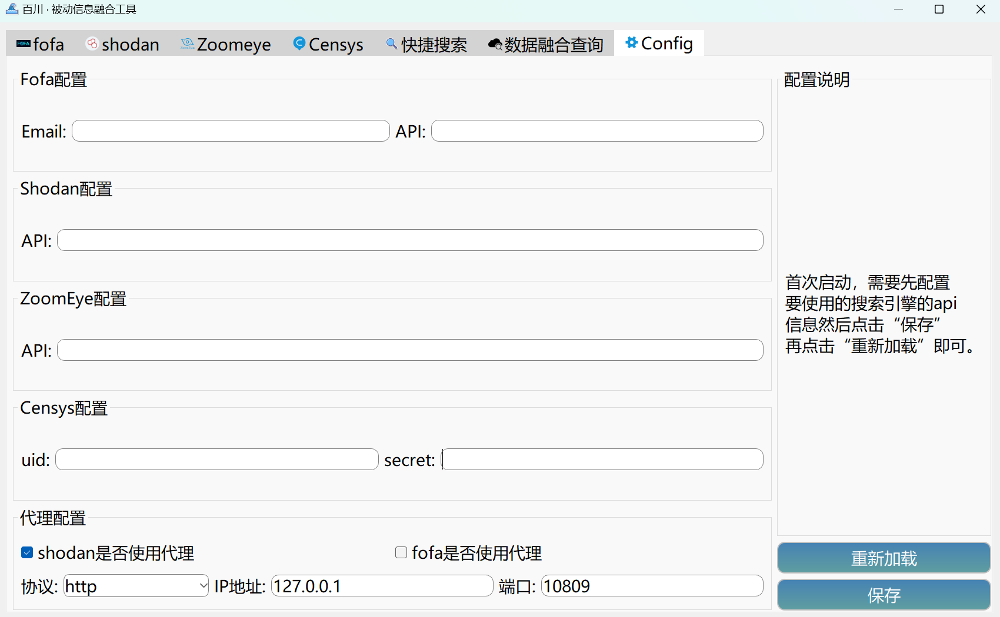

